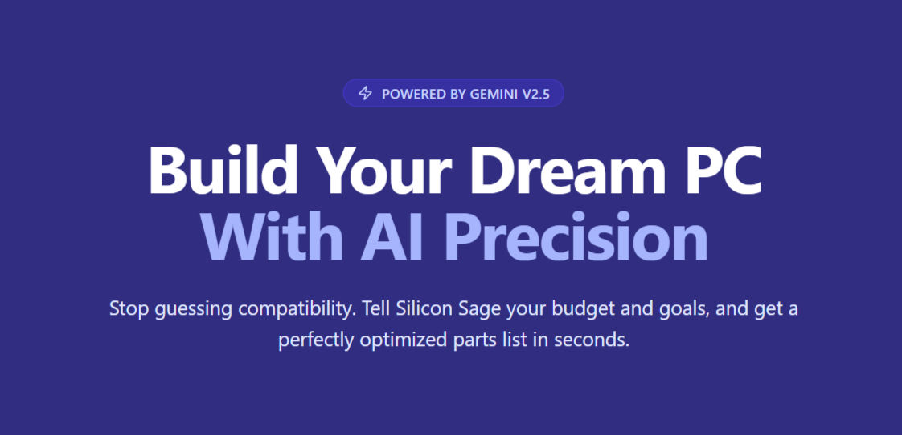

<div align="center">

</div>

# Silicon Sage - AI-Powered PC Builder

Silicon Sage is an intelligent PC building assistant powered by Google's Gemini AI. It analyzes your budget, use cases, and preferences to generate optimized computer builds with perfect component compatibility.

## Problem Statement

Building a custom PC can be overwhelming and error-prone:
- Thousands of components (CPU, GPU, motherboard, PSU) have strict compatibility requirements (socket types, wattage, size).
- Users often juggle multiple browser tabs to check specs, prices, and reviews.
- A single mismatch (e.g., Intel CPU with AMD motherboard) can waste money and time.
- Budgeting for both performance and aesthetics (RGB, color themes, form factors) requires complex calculations that intimidate beginners.

Without guidance, even enthusiasts can make costly mistakes.

## Solution Statement
**Silicon Sage** solves this by acting as an AI-powered PC building consultant:
- **AI-Powered Build Generation:** Uses Gemini 2.5 Pro to generate fully compatible builds based on budget, goals, and style preferences.
- **Real-time Chat Interface:** Users can iteratively swap parts, adjust budgets, or refine aesthetics while maintaining compatibility.
- **Performance Estimation:** Calculates total power draw, FPS for gaming, and workstation scores.
- **Multi-Currency & Vendor Support:** Handles MYR, USD, EUR and provides links to purchase components.
- **Aesthetic Awareness:** Honors requests like RGB lighting, white builds, or small form factor setups.

The result: optimized, validated builds in under 30 seconds, with reduced risk of mistakes and wasted money.

## 🎯 Features

- **AI-Powered Build Generation** - Uses Gemini 2.5 Pro to create optimized PC configurations
- **Real-time Chat Interface** - Ask the AI to swap components, adjust budgets, or modify builds
- **Component Compatibility Checking** - Ensures all selected parts work together seamlessly
- **Multi-currency Support** - MYR, USD, EUR pricing
- **Aesthetic Preferences** - RGB lighting, color themes, form factors
- **Performance Estimation** - Calculate power draw, gaming FPS, workstation scores
- **Vendor Integration** - Direct links to purchase components

## 📋 Architecture

### Frontend (TypeScript + React)

- **Pages:**
  - `Home.tsx` - Build configuration form
  - `ReportDashboard.tsx` - Results display with chat interface
- **Types:** Comprehensive TypeScript schemas matching backend models
- **API Integration:** Connects to backend via REST API

### Backend (Python + Google ADK)

- **Agent:** `agent.py` - Main orchestration with Gemini 2.5 Pro
- **Sub-agents:** Research agent for component recommendations
- **Tools:** Build metrics calculation
- **Output Schema:** `SiliconSageBuildReport`

## 🚀 Quick Start

### Frontend Setup

```bash
cd front_end
npm install
npm run dev
```

Create `.env`:

```env
VITE_API_URL=http://localhost:8000
```

### Backend Setup

```bash
cd silicon_sage
uv sync
uv run -m silicon_sage.main
```

## 📦 Request Schema

```typescript
{
  financials: {
    budget_cap: 5000,
    currency: "MYR",
    flexibility: "moderate"
  },
  build_requirements: {
    primary_use: ["Gaming", "Streaming"],
    target_resolution: "1440p",
    form_factor_target: "ATX"
  },
  component_preferences: {
    lighting_style: "RGB",
    color_theme: "White",
    cpu_preferred_platform: "Any"
  },
  user_prompt: "Optional custom instructions"
}
```

## 📊 Response Schema

```typescript
{
  report_meta: {
    build_id: "build_123",
    generated_at: "2024-01-15T10:30:00Z",
    total_estimated_cost: 5500,
    currency: "MYR"
  },
  components: {
    cpu: { model_name, price, vendor_url, specs },
    motherboard: { ... },
    ram: { ... },
    storage: { ... },
    gpu: { ... },
    psu: { ... }
  },
  performance_estimates: {
    calculated_total_wattage: 650,
    gaming_1440p_fps: "120-144",
    workstation_score: "9500"
  }
}
```

## 🔌 API Endpoints

### `POST /api/build`

Generate a complete PC build based on requirements.

- **Request:** `SiliconSageBuildRequest`
- **Response:** `SiliconSageBuildReport`

### `GET /api/primary-use-options`

Fetch available primary use case options.

- **Response:** `{ options: string[] }`

## 🛠️ Tech Stack

### Frontend

- React 18 + TypeScript
- Tailwind CSS
- Lucide Icons
- React Router
- Vite

### Backend

- Python 3.10+
- Google ADK (Agent Development Kit)
- Gemini 2.5 Pro Model
- In-Memory Session/Memory Services

## 🎨 Component Types

- **CPU** - Processor with socket, core count, clock speed
- **GPU** - Graphics card with VRAM and power specs
- **Motherboard** - Socket compatibility and form factor
- **RAM** - Memory specifications
- **Storage** - SSD/HDD options
- **PSU** - Power supply wattage and modular rating

## 💬 Chat Features

The ReportDashboard includes a real-time chat with the AI agent to:

- Swap component recommendations
- Adjust budget allocations
- Modify aesthetic preferences
- Add special requirements

## 📱 Responsive Design

- Mobile-optimized forms (Home page)
- Split-view dashboard (Desktop: left report, right chat)
- Single-column layout (Mobile: stacked)

## 🚧 Future Enhancements

- [ ] Database integration for component catalogs
- [ ] User accounts and build history
- [ ] Component availability checking
- [ ] Price comparison across vendors
- [ ] Build export (PDF, sharing)
- [ ] Community builds
- [ ] Multi-language support

## 📄 License

MIT

## 🤝 Contributing

Pull requests welcome. For major changes, open an issue first.

---

**Built with AI-powered intelligence. Optimize your build. Perfect your PC.**
